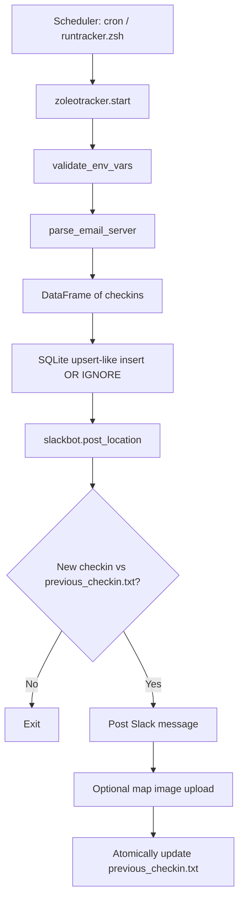

# ZoleoTracker

## About

ZoleoTracker is an automated Python script to post a _ZOLEO_ device user's current location to slack or other social media (coming soon).

At runtime, it:
1. Connects to an IMAP inbox.
2. Parses ZOLEO check-in emails into structured records.
3. Persists check-ins in SQLite with deduplication.
4. Posts the most recent check-in to Slack only if it's newer than the last posted check-in.
5. Optionally uploads a Google Static Maps image for the latest coordinates.

## Why?

My housemate decided that it would be fun to bike across the country, and I wanted to automate how friends and family were updated on his location.
Since _ZOLEO_ devices (the gps that he took with him), don't have a REST API available, I decided to parse the automated emails that are sent every time he checks in.

I also wanted an excuse to build a python app that integrates with slack and social media backends!

## Example Slack Message


## Architecture

ZoleoTracker is intentionally designed as a batch pipeline (not a long-running daemon). A scheduler (typically cron) invokes one run, and each run is deterministic from current inbox + local state.

### High-level execution flow



### Module responsibilities

- `zoleotracker/zoleotracker.py`
	- Entry workflow orchestration (`start`, `tracker`).
	- IMAP access and email parsing.
	- Converts parsed records to database-ready tuples.
- `zoleotracker/databaseSQL.py`
	- SQLite connection lifecycle (`db_connection` context manager).
	- Schema creation, inserts, and latest-row reads.
	- Check-in timestamp normalization.
- `zoleotracker/slackbot.py`
	- Slack client creation and message posting.
	- New-checkin gating via persisted previous timestamp.
	- Atomic file write for state updates.
- `zoleotracker/maps.py`
	- GPS string parsing (N/S/E/W handling).
	- Google Static Maps URL building + image fetch.
- `zoleotracker/config.py`
	- Centralized runtime settings and environment overrides.
- `zoleotracker/__main__.py`
	- Allows `python -m zoleotracker` style entrypoint.

## Implementation Details

### 1. Email ingestion and parsing

- Uses `imaplib.IMAP4_SSL` against `imap.gmail.com` by default.
- Scans the selected folder for all messages, then filters by exact subject match:
	- `Check-in message from SlothPace`
- Decodes payload content and converts it to plain text via `html2text`.
- Extracts fields with regex patterns:
	- Location: `My location is ...`
	- Check-in time: `sent at: ... (UTC)`
	- Map link: markdown link target from `View on map`
- Each message missing any required field is skipped safely (warning log, no hard failure).

### 2. Data model and persistence

SQLite table:

```sql
CREATE TABLE IF NOT EXISTS tracker (
		id INTEGER PRIMARY KEY AUTOINCREMENT,
		file TEXT,
		checkin TEXT NOT NULL UNIQUE,
		location TEXT NOT NULL,
		link TEXT NOT NULL
)
```

Implementation notes:
- `checkin` is stored as `YYYY-MM-DD HH:MM:SS` and marked `UNIQUE`.
- Inserts use `INSERT OR IGNORE`, which provides idempotency across repeated runs.
- Database writes are wrapped in a context manager that commits on success and rolls back on exceptions.
- Default DB location is project-local `zoleo.db`, override with `ZOLEO_DB_PATH`.

### 3. Slack delivery semantics

- The latest check-in is loaded from SQLite (`ORDER BY id DESC LIMIT 1`).
- `previous_checkin.txt` stores the last posted check-in timestamp.
- Slack post occurs only when `current_checkin > previous_checkin`.
- After successful send, the state file is updated atomically using a temporary file + `os.replace`, minimizing corruption risk on interruption.

### 4. Optional map image generation

- Enabled only when `GOOGLE_MAPS_API_KEY` is set.
- Parses coordinates like `47.6 N, 122.3 W` into signed floats.
- Fetches image bytes from Google Static Maps API and uploads as a Slack file attachment.
- Map upload errors are non-fatal to primary text notification flow.

### 5. Runtime model

- Intended cadence is periodic batch execution (for example every 30 minutes).
- This avoids maintaining a resident service and keeps operational complexity low.
- Re-running is safe due to database dedupe + post gating.

## Configuration

### Required environment variables

- `EMAIL_ACCOUNT`: mailbox username/login
- `EMAIL_PASSWORD`: mailbox app password
- `SLACK_TOKEN`: Slack bot token used by `slack.WebClient`

### Optional environment variables

- `GOOGLE_MAPS_API_KEY`: enables map image generation
- `ZOLEO_DB_PATH`: custom SQLite file path

### Static config values (`zoleotracker/config.py`)

- `EMAIL_SERVER` (default: `imap.gmail.com`)
- `EMAIL_FOLDER` (default: `inbox`)
- `CHECKIN_EMAIL_SUBJECT` (default: `Check-in message from SlothPace`)
- `SLACK_CHANNEL` (default: `#jordan-tracker`)
- `PREVIOUS_CHECKIN_FILE` (default project-local `previous_checkin.txt`)

## Reliability and Failure Handling

- Startup fails fast when required environment variables are missing.
- IMAP connection failures terminate the run with logged errors.
- Malformed or incomplete emails are skipped instead of crashing the whole batch.
- Database transaction handling ensures partial writes are rolled back.
- Slack API failures are surfaced so the scheduler can alert/retry.
- Optional map upload failures are downgraded to warnings.

## Testing Strategy

The test suite uses `pytest` with mocks for external systems (IMAP, Slack API, HTTP):

- `tests/test_zoleotracker.py`
	- Date parsing behavior.
	- Email parse success/failure paths.
	- Subject filtering and empty inbox behavior.
- `tests/test_database.py`
	- Table creation/exists checks.
	- Insert/read behavior.
	- Duplicate check-in dedupe behavior.
- `tests/test_slackbot.py`
	- New-checkin gating logic.
	- Posting vs skipping decisions.
	- Map upload integration behavior.
- `tests/test_maps.py`
	- Coordinate parsing across hemispheres.
	- Static map URL generation.
	- HTTP success/error behavior for map fetch.

Run tests:

```bash
uv run pytest
```


## Project Layout

```text
zoleotracker/
	__main__.py        # python -m entrypoint
	config.py          # runtime constants and env-driven settings
	databaseSQL.py     # sqlite schema + CRUD utilities
	maps.py            # coordinate parsing + static map fetch
	slackbot.py        # Slack posting + post-state management
	zoleotracker.py    # orchestration, IMAP parsing, pipeline entry
tests/
	test_database.py
	test_maps.py
	test_slackbot.py
	test_zoleotracker.py
```


## Getting Started

ZoleoTracker is designed to run in a Python environment managed by uv. It is a single run script, and I've set up a cronjob to run it every 30mins for my use.

1. Clone this repository
2. Edit the *config.py* to include your email server and inbox settings.
3. Set environment variables for `SLACK_TOKEN`, `EMAIL_ACCOUNT`, and `EMAIL_PASSWORD`
	- Optional: set `GOOGLE_MAPS_API_KEY` to include map images.
	- Optional: set `ZOLEO_DB_PATH` to use a non-default SQLite location.
4. Run `uv sync` from the high level directory.
5. If you want to automate the script, create a cronjob that executes `uv run zoleotracker` from the high level project directory.

Example cronjob: `*/30 * * * * cd {project_directory} && ./runtracker.zsh` 

Example `runtracker.zsh`:

```
#!/bin/zsh
export SLACK_TOKEN="secret-slack-token"
export EMAIL_ACCOUNT="user@mail.com"
export EMAIL_PASSWORD="mailapppassword"
uv run zoleotracker
```


## Contributions

To contribute, please visit the [contributing](CONTRIBUTING.md) guidelines.
